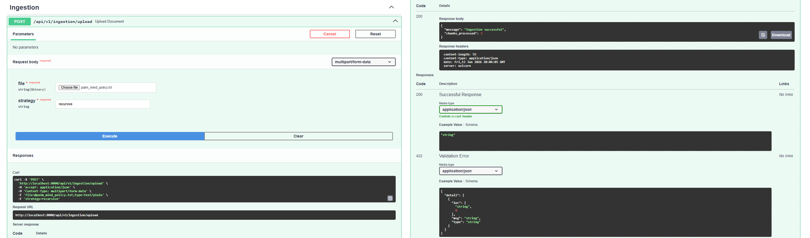
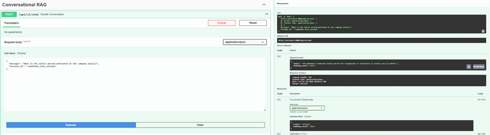

# Palm Mind RAG Platform — Backend
 
A production-oriented RAG (Retrieval-Augmented Generation) backend built with FastAPI, Google GenAI, Pinecone, and Redis. Implements custom document ingestion, multi-turn conversational retrieval, and transactional interview booking — without relying on framework abstractions like LangChain or RetrievalQAChain.
 
---
 
## Tech Stack
 
| Layer | Technology | Reason |
|---|---|---|
| API Framework | FastAPI | Async-native, Pydantic validation, auto-generates OpenAPI docs |
| LLM & Embeddings | Google GenAI SDK (2026) | Official modern SDK — avoids deprecated `google-generativeai` |
| Vector Store | Pinecone | Managed cosine similarity search, serverless-friendly |
| Chat Memory | Redis | Session-scoped history caching without ORM overhead |
| Relational Store | SQLAlchemy + SQLite | Structured metadata and booking transaction persistence |
 
---
 
## Features
 
### Document Ingestion — `POST /api/v1/ingestion/upload`
 
Accepts `.txt` or `.pdf` files via `multipart/form-data`. Supports two selectable chunking strategies:
 
- **Recursive** — splits on paragraph and sentence boundaries, preserving semantic coherence
- **Character** — fixed-size splits, useful for uniform token budgeting
Each chunk is embedded using Google's latest embedding model with output dimensionality truncated to **768** via Matryoshka Representation Learning (MRL) — matching the Pinecone index without rebuilding it. Chunk metadata is persisted to SQLite alongside the Pinecone upsert.
 
### Conversational RAG — `POST /api/v1/chat`
 
Accepts a `message` and `session_id`. The pipeline:
 
1. Fetches session history from Redis
2. Embeds the incoming query
3. Retrieves top-k relevant chunks from Pinecone
4. Synthesizes a grounded response via the Gemini generation model
5. Writes the updated turn back to Redis
No `RetrievalQAChain`. No LangChain. The retrieval and generation steps are explicit and independently controllable.
 
### Interview Booking
 
If the user's message signals booking intent, a parallel Pydantic schema extraction layer uses structured LLM output to capture:
 
- Full name
- Email address
- Preferred date (`YYYY-MM-DD`)
- Preferred time (`HH:MM`)
Confirmed bookings are written to the SQLite database transactionally.
 
---
 
## Infrastructure Decisions Worth Noting
 
### Embedding Dimension Management
The modern Gemini embedding model outputs 3,072-dimensional vectors by default. Rather than rebuilding the Pinecone index, the embedding call passes `output_dimensionality=768` inside `EmbedContentConfig`, exploiting native MRL truncation at the API level. Accuracy loss is minimal.
 
### Generation Failover
The primary generation call is wrapped in a try-except targeting `503 UNAVAILABLE` (Google's high-demand response). On failure, traffic is automatically routed to a lighter model instance — the client never sees the error.
 
---
 
## Local Setup
 
### 1. Environment Variables
 
Create a `.env` file in the project root:
 
```env
GEMINI_API_KEY=your_google_gemini_api_key
PINECONE_API_KEY=your_pinecone_api_key
PINECONE_INDEX_NAME=your_index_name
REDIS_URL=redis://localhost:6379/0
DATABASE_URL=sqlite:///./app.db
```
 
### 2. Install Dependencies
 
```powershell
# Activate your virtual environment first
.venv\Scripts\Activate.ps1
 
pip install -r requirements.txt
```
 
### 3. Run the Server
 
```powershell
python main.py
```
 
API docs available at: `http://localhost:8000/docs`
 
---
 
## API Reference
 
### Upload Document
 
```
POST /api/v1/ingestion/upload
Content-Type: multipart/form-data
 
file:     <your .txt or .pdf>
strategy: recursive | character
```
 
**Success (200):**
 

 
---
 
### Chat
 
```
POST /api/v1/chat
Content-Type: application/json
 
{
  "message": "What is the notice period policy?",
  "session_id": "user-abc-123"
}
```
 
**Success (200):**
 

 
---
 
### Health Check
 
```
GET /health
```
 
---
 
## What I Would Add With More Time
 
These are genuine next steps, not just padding:
 
**Hybrid Search** — combining dense vector retrieval with sparse BM25 matching. Exact keyword lookups (policy codes, names, dates) degrade with pure embedding search. BM25 covers that gap cleanly.
 
**Cross-Encoder Re-ranking** — a lightweight local re-ranker (BGE-Reranker or similar) applied after Pinecone retrieval to reorder chunks by relevance before passing context to the generation model. Reduces token waste and improves answer precision.
 
**Async Ingestion Queue** — offloading chunking and embedding to a background worker (Celery + Redis or RabbitMQ). Currently large files block the main server thread. A task queue decouples upload acknowledgment from processing completion.
 
**Streaming Responses** — piping the generation output as a server-sent event stream so the client receives tokens progressively rather than waiting for the full response.
 
---
 
## Project Structure
 
```
├── app/
│   ├── api/
│   │   ├── ingestion.py       # Upload endpoint
│   │   └── chat.py            # Conversational RAG endpoint
│   ├── services/
│   │   ├── llm.py             # Embedding + generation logic
│   │   ├── vector_store.py    # Pinecone client wrapper
│   │   └── memory.py          # Redis session management
│   ├── models/
│   │   └── booking.py         # SQLAlchemy booking schema
│   └── core/
│       └── config.py          # Environment + settings
├── main.py
├── requirements.txt
└── .env.example
```
 
---
 
Built as part of the Palm Mind AI technical assessment.